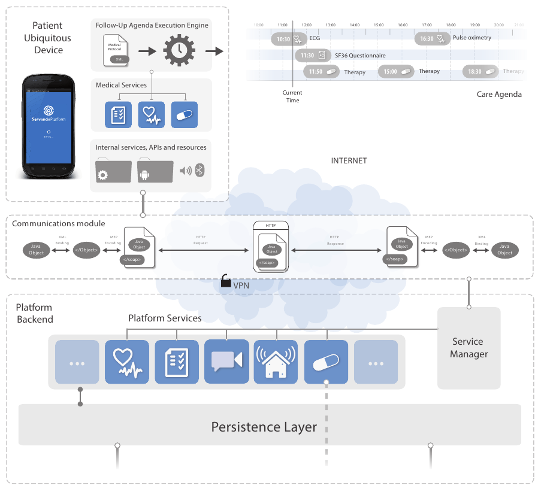

Servando is an open and distributed telemedicine platform based on Android, developed by the intelligent systems unit in the Centro de Investigación en Tecnoloxías da Información (CITIUS) of the University of Santiago de Compostela.
Servando deals with a number of recurrent problems in telemedicine systems, such as:
- The scheduling of the different medical actions that should be executed, organized in a personalized agenda generated from a follow-up protocol.
- Functionality encapsulation and reuse in a set of services.
- Communications between the patient home and the hospital, through a flexible scheme for bidirectional message exchange.
- The management of the events and alerts generated during the monitoring.

Servando allows the development of generic telemedicine applications, adaptable according to the disease or the particular characteristics of the patient.

Platform Architecture
==============================
The figure below shows the Servando Platform architecture:

The platform architecture is based on services, that are distributed entities who provide the logic needed to perform a set of medical actions (e.g.: fill a questionnaire, measure temperature, ...).
These actions are temporarily arranged by the [Agenda Execution Engine](https://github.com/citiususc/servando-core/blob/master/src/main/src/es/usc/citius/servando/android/agenda/ProtocolEngine.java) according to a [protocol](ServandoApp/src/main/assets/protocol.xml), and executed at the appropriate time. The protocol is a declarative description of the actions to be performed by the patient during the follow-up, according to the [MedicalProtocol](src/main/src/es/usc/citius/servando/android/models/protocol/MedicalProtocol.java) and [ProtocolAction](https://github.com/citiususc/servando-core/blob/master/src/main/src/es/usc/citius/servando/android/models/protocol/ProtocolAction.java) models.

Services and medical actions can easily communicate with the server using the WS based communications module, that allows them to send XML Serialized Java Objects to their server side endpoint.

In the server, services can receive the information received from the client side, and deal with it as they want, for example storing it in a database for visualization, or publishing it under a REST API.

>**A module for receiving the messages sent by the different services will be available soon in a separate repository.**

Setting up the project
==============================
In order to set up this project for development, import it from Android Studio, and then include the [core module dependency](https://github.com/citiususc/servando-core) in the PlatformIndependentLibs folder. 

More info
==============================
For general information about the project, APIs, guides and publications, visit our project page: http://proxectos.citius.usc.es/servando/

*Note:* This project is being migrated from Google Code: http://servando.googlecode.com.
